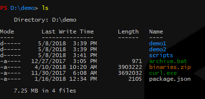
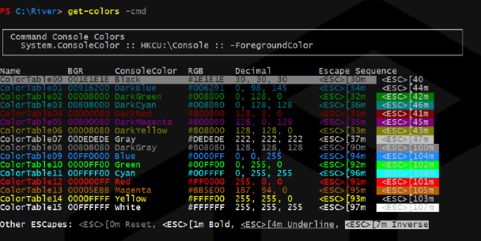
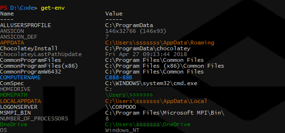
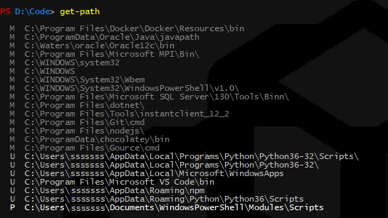

# PowerShell Scripts

These scripts are my custom profile scripts for PS command windows and for ISE including
a custom "Dark Selenitic" theme for ISE.

## How to install

This entire repo can be overlayed ontop of your Documents\WindowsPowerShell folder.

If downloading the repo as a Zip file then you'll need to unblock all files:

```powershell
Get-ChildItem -Path "${env:USERPROFILE}\Documents\WindowsPowerShell' -Recurse | Unblock-File
```

And if installing on a brand new machine or VM then loosen up the execution policy:

```powershell
Set-ExecutionPolicy RemoteSigned
```

## Commands
These scripts are located in the Modules\Scripts folder.

##### `Clear-Events`
Clear all events from the Windows Event Log.

#### `Confirm-Elevated`
Determine if the current session is elevated and displays a warning message if not. Can be run without the warning message and simply return a boolean result.

#### `ConvertTo-Hex`
Convert integer values to a Hex string. If one integer is specified then it is converted. If three integers are specified then they are assumed to be RGB values and combined into a single Hex string.

#### `Copy-Console`
Copy the contents of the Powershell console window preserving color. Can be sent to an out file or pasted into Word or OneNote.

#### `Edit-PSProfile`
Run VSCode with ~Documents\WindowsPowerShell as root folder. Aliased to `ep`

#### `Get-Account`
Report the account information for the given username and optionally a specified domain.


#### `Get-ChildItemColorized`
Display a colorized directory listing along with total size. Aliased to `ls`



#### `Get-Colors`
Display the console colors for Command console, PowerShell console, and ConEmu consoles.



#### `Get-DirSize`
Report the size of all items in the specified folder. Used as a sub-routine of Get-ChildItemColorized.

#### `Get-DotNetVersion`
Get the versions of.NET Framework installations on the local computer.

#### `Get-Env`
Report environment variables in colorized categoties with optional search highlighting.



#### `Get-Hosts`
Display the /etc/hosts file, colorized.

#### `Get-Installed`
Report all installed applications registered on the local system.

#### `Get-Network`
Determines the most likely candidate for the active Internet-specific network adapter on this machine.  All other adpaters such as tunneling and loopbacks are ignored.  Only connected IP adapters are considered. Wifi aliases are shown.


#### `Get-Path`
Display the PATH environment variable as a list of strings rather than a single string and displays the source of each value defined in the Registry: Machine, User, or Process



#### `Get-Performance`
Get and report performance metrics using the built-in WinSAT utility.

#### `Get-SpecialFolder`
Return the translation of a SpecialFolder by name or show all SpecialFolders with optional search highlighting.

#### `Get-VMConfig`
Returns a VM configuration object of the specified .vmcx VM configuration
file even if the VM is not attached to a Hyper-V server.

#### `Install-Chocolatey`
Can be used on new machines to install Chocolately. If already installed then
checks if it is outdated and prompts to update.

#### `Invoke-SuperUser`
Open a new command prompt in elevated mode. Aliased to `su`. Special command for ConEmu emulator.

#### `Invoke-VsDevCmd`
Invoke the Visual Studio environment batch script. Aliased to `vs`

#### `New-CommandWrapper`
Sepcial internal function from PowerShell Cookbook.

#### `New-VMClone`
Create a new VM from a registered VM or an exported VM.

#### `Remove-DockerTrash`
Prune unused docker containers and dangling images.

#### `Remove-Locked`
Remove a System-owned file or directory. Attempts multiple approaches to remove stubborn items.

#### `Repair-Path`
Clean up the PATH environment variable, removing duplicates, empty values, and optionally paths that do not exist.

#### `Set-Color`
Set a custom value for the specified console color table entry in one or all of the
Cmd, PowerShell, and ConEmu consoles.

#### `Set-OutDefaultOverride`
(Internal) Helper function for Get-ChildItemColorized.

#### `Show-ColorizedContent`
Type the contents of a PowerShell script with syntax highlighting.


#### `Show-Docker`
Show containers and images in a single command.

#### `Set-RegistryOwner`
Set full-access ownership of a specified Registry key.

#### `Start-VMUntilReady`
Start the named VM, optionally restoring the latest snapshot, and waiting
until the OS provides a stable heartbeat.

## Profiles

#### Microsoft.PowerShell_profile.ps1

This the primary PowerShell profile definition script, run whenenver a new PowerShell command
prompt is open or session is created. It defines aliases for some of the commands above. It also
invokes special utilities unique to my environment such as integration with ConEmu, WiLMa, 
Chocolatey, and setting the intial working directory.

##### Console Prompt Customization

The PowerShell command prompt is customized as follows:

* It is rendered in blue
* It indicates the current working directory prefaced with "PS" for example `PS D:\code>`
* If the console is elevated then the "PS" prefix is shown in red to highlight the fact that what do you, you do at your own risk!

  


#### Microsoft.PowerShellISE_profile.ps1

This is the profile definition script fort the PowerShell ISE editor. It registers ISE add-ons
found in the Modules\Addons folder.

#### Microsoft.VSCode_profile.ps1

This is the profile definition script for the VSCode integrated PowerShell terminal.
It simply invokes the primary profile script above.

## Dark Selenitic Scheme

The `Dark Selenitic.StorableColorTheme.ps1xml` file defines the Dark Selenitic color scheme for ISE. The theme is also
defined by the Themes\PSTheme_Selenitic.ps1 script.
